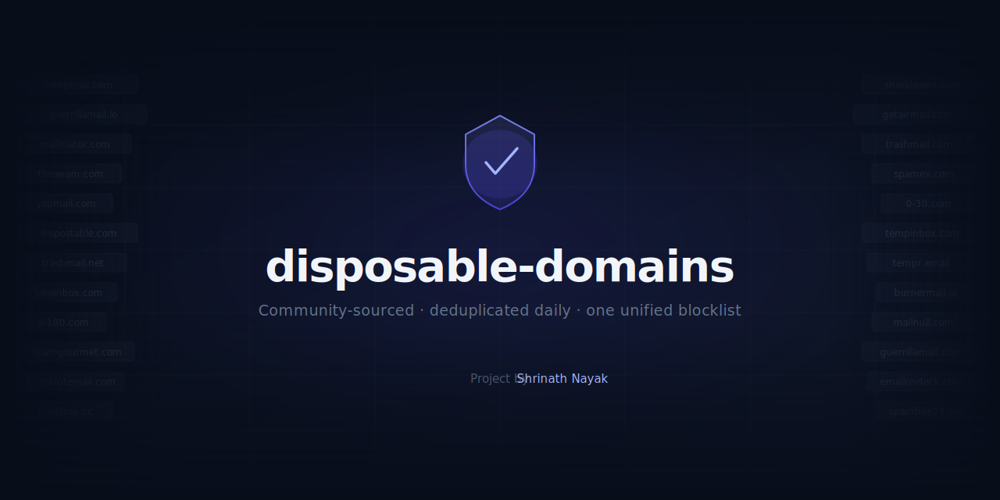

# disposable-domains

<p align="center">
  
</p>

**One unified blocklist of disposable email domains — merged from 27 community sources, deduplicated, and rebuilt every day.**

[🚀 Usage](#usage) · [📄 Output format](#output-format) · [🌐 Sources](#sources) · [🤝 Contributing](#contributing) · [🛠 Local dev](#local-development)

---

## 📊 Stats

<!-- STATS_START -->
| Metric | Value |
|--------|-------|
| Disposable Domains | 274,153 |
| Sources | 27 |
| Generated on | Sat, 11 Apr 2026 03:07:46 GMT |
<!-- STATS_END -->

---

## 🛡 Why this exists

Every disposable email blocklist has blind spots. This repo pulls from **27 community-maintained lists**, merges them into a single sorted `domains.json`, and pushes an update every day at 02:00 UTC — so you get broader coverage without managing multiple upstreams yourself.

---

## 🚀 Usage

Grab the raw file and check against it in any language:

```
https://cdn.jsdelivr.net/gh/shrinathsnayak/disposable-domains/domains.json
```

### TypeScript / JavaScript

```ts
const { domains } = await fetch(
  "https://cdn.jsdelivr.net/gh/shrinathsnayak/disposable-domains/domains.json",
).then((r) => r.json());

const blocked = new Set<string>(domains);

function isDisposable(email: string): boolean {
  return blocked.has(email.split("@")[1]?.toLowerCase() ?? "");
}
```

### Python

```python
import urllib.request, json

with urllib.request.urlopen(
  "https://cdn.jsdelivr.net/gh/shrinathsnayak/disposable-domains/domains.json"
) as res:
    data = json.load(res)

blocked = set(data["domains"])

def is_disposable(email: str) -> bool:
    parts = email.lower().rsplit("@", 1)
    return len(parts) == 2 and parts[1] in blocked
```

### 🔍 Inspect metadata with curl

```bash
curl -s https://cdn.jsdelivr.net/gh/shrinathsnayak/disposable-domains/domains.json \
  | jq '.meta'
```

---

## 📄 Output format

`domains.json` has two top-level keys — `meta` for auditing and `domains` for lookups:

```json
{
  "meta": {
    "generated_on": "2026-04-10T02:00:00.000Z",
    "total": 196394,
    "source_count": 27,
    "sources": [
      {
        "name": "ivolo/disposable-email-domains",
        "url": "...",
        "raw_count": 121557,
        "status": "ok"
      }
    ]
  },
  "domains": ["0-180.com", "0-30.com", "..."]
}
```

The `meta.sources` array records the per-source domain count and fetch status, making it easy to spot a broken upstream at a glance.

---

## ⚙️ How it works

Every day at **02:00 UTC**, the GitHub Actions workflow:

1. Fetches all 27 upstream blocklists **concurrently** (capped at 8 in-flight to avoid rate-limiting)
2. Merges domains into a `Set` as each source resolves — no waiting for the full batch
3. Filters out legitimate providers via a remote **allowlist** and any entries in `ALLOWED_DOMAINS`
4. Writes a single sorted `domains.json` with full source stats
5. Commits the result **only if the content actually changed**

You can also trigger a manual run any time from the Actions tab via `workflow_dispatch`.

---

## 🌐 Sources

27 community lists, merged into one:

| Source                                                                                                                    | Format           |
| ------------------------------------------------------------------------------------------------------------------------- | ---------------- |
| [disposable-email-domains/disposable-email-domains](https://github.com/disposable-email-domains/disposable-email-domains) | lines            |
| [disposable/disposable-email-domains (TXT)](https://disposable.github.io/disposable-email-domains/domains.txt)            | lines            |
| [disposable/disposable-email-domains (MX-verified)](https://disposable.github.io/disposable-email-domains/domains_mx.txt) | lines            |
| [ivolo/disposable-email-domains](https://github.com/ivolo/disposable-email-domains)                                       | json_array       |
| [wesbos/burner-email-providers](https://github.com/wesbos/burner-email-providers)                                         | lines            |
| [FGRibreau/mailchecker](https://github.com/FGRibreau/mailchecker)                                                         | lines            |
| [flotwig/disposable-email-addresses](https://github.com/flotwig/disposable-email-addresses)                               | lines            |
| [daisy1754/jp-disposable-emails](https://github.com/daisy1754/jp-disposable-emails)                                       | lines            |
| [unkn0w/disposable-email-domain-list](https://github.com/unkn0w/disposable-email-domain-list)                             | lines            |
| [amieiro/disposable-email-domains](https://github.com/amieiro/disposable-email-domains)                                   | lines            |
| [stopforumspam/toxic_domains](https://www.stopforumspam.com)                                                              | lines            |
| [MattKetmo/EmailChecker](https://github.com/MattKetmo/EmailChecker)                                                       | lines            |
| [adamloving/disposable-email-domains](https://gist.github.com/adamloving/4401361)                                         | lines            |
| [jamesonev/disposable-email-domains](https://gist.github.com/jamesonev/7e188c35fd5ca754c970e3a1caf045ef)                  | lines            |
| [disposable/static-disposable-lists (mail-data-hosts-net)](https://github.com/disposable/static-disposable-lists)         | lines            |
| [disposable/static-disposable-lists (manual)](https://github.com/disposable/static-disposable-lists)                      | lines            |
| [7c/fakefilter](https://github.com/7c/fakefilter)                                                                         | lines            |
| [GeroldSetz/emailondeck.com-domains](https://github.com/GeroldSetz/emailondeck.com-domains)                               | lines            |
| [groundcat/disposable-email-domain-list](https://github.com/groundcat/disposable-email-domain-list)                       | lines            |
| [romainsimon/emailvalid](https://github.com/romainsimon/emailvalid)                                                       | json_object_keys |
| [andreis/disposable-email-domains](https://github.com/andreis/disposable-email-domains)                                   | lines            |
| [TheDahoom/disposable-email](https://github.com/TheDahoom/disposable-email)                                               | lines            |
| [eser/sanitizer-svc](https://github.com/eser/sanitizer-svc)                                                               | lines            |
| [kslr/disposable-email-domains](https://github.com/kslr/disposable-email-domains)                                         | lines            |
| [sublime-security/static-files](https://github.com/sublime-security/static-files)                                         | lines            |
| [doodad-labs/disposable-email-domains](https://github.com/doodad-labs/disposable-email-domains)                           | lines            |
| [Propaganistas/Laravel-Disposable-Email](https://github.com/Propaganistas/Laravel-Disposable-Email)                       | json_array       |

---

## 🤝 Contributing

### ➕ Adding a source

1. Add an entry to `BLOCKED_SOURCES` in [`src/blocked-sources.ts`](src/blocked-sources.ts):

```ts
{
  name: "owner/repo-name",
  url: "https://raw.githubusercontent.com/owner/repo/main/domains.txt",
  format: "lines", // "lines" | "json_array" | "json_object_keys"
}
```

2. Supported formats:

| Format             | Description                                                            |
| ------------------ | ---------------------------------------------------------------------- |
| `lines`            | One domain per line — `#`, `//`, and `;` comment prefixes are stripped |
| `json_array`       | Top-level JSON array of domain strings                                 |
| `json_object_keys` | JSON object where domain names are the keys                            |

3. Run `npm run generate` locally to confirm the source resolves correctly, then open a PR.

### ✅ Whitelisting a domain

To prevent a domain from ever appearing in the output, add it to `ALLOWED_DOMAINS` in [`src/allowed-sources.ts`](src/allowed-sources.ts):

```ts
export const ALLOWED_DOMAINS: string[] = ["example.com"];
```

This is merged with the remote allowlist at generation time.

---

## 📁 Project structure

```
disposable-domains/
├── src/
│   ├── blocked-sources.ts   upstream blocklist sources (27 entries)
│   ├── allowed-sources.ts   remote allowlist URL + ALLOWED_DOMAINS
│   ├── constants.ts         output path, concurrency limit, domain regex
│   ├── logger.ts            winston logger (timestamp + colorized level)
│   ├── types.ts             TypeScript interfaces (Source, SourceStat)
│   ├── utils.ts             fetch, parse, and concurrency helpers
│   └── generate.ts          orchestration entry point
├── test/
│   └── utils.test.ts        unit tests for parse helpers
├── .github/workflows/
│   ├── generate.yml         daily cron — regenerates and commits domains.json
│   └── test.yml             runs on every PR
├── domains.json
└── README.md
```

---

## 🛠 Local development

Requires **Node 22+**.

```bash
npm install

npm run generate   # regenerate domains.json
npm test           # run unit tests
npm run build      # compile to dist/
```

---

## 📜 License

MIT — see [LICENSE](LICENSE).

---

Project by [Shrinath Nayak](https://snayak.dev)
